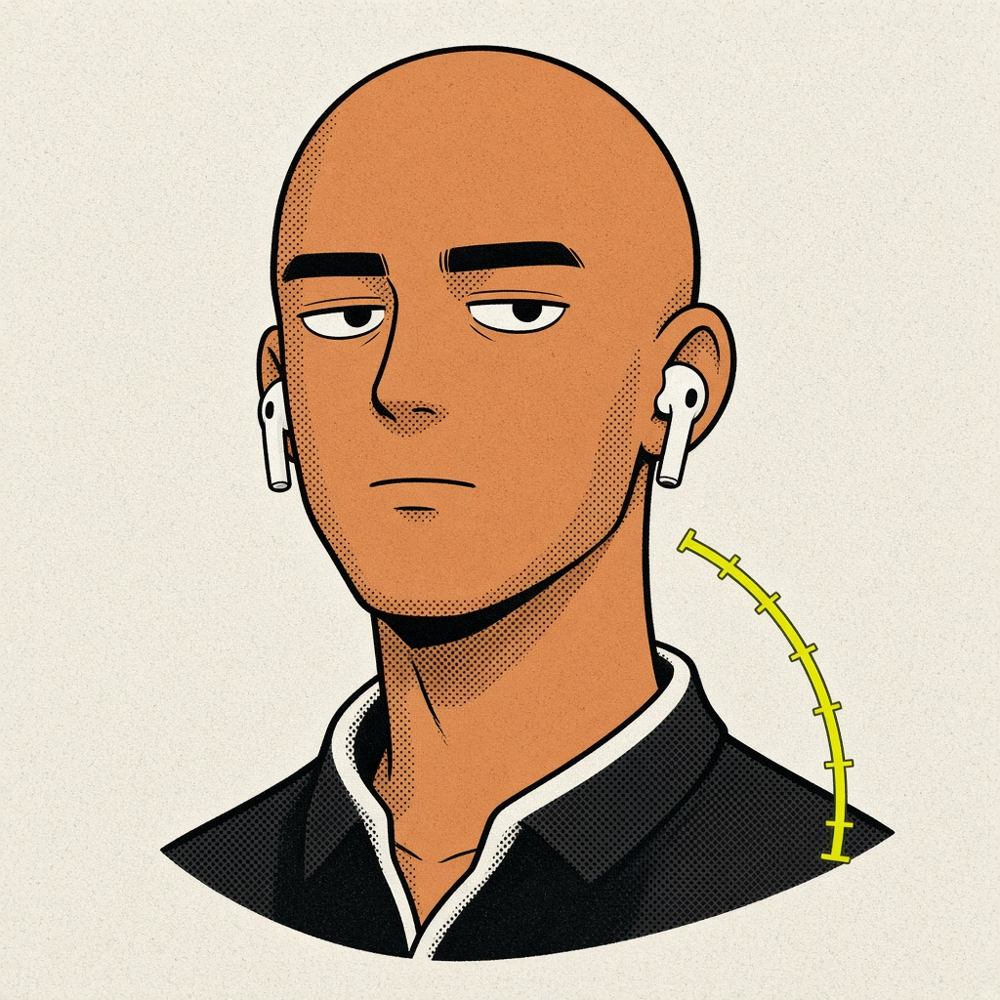

<p align="center">
  
</p>

<h1 align="center">AirPoise</h1>

<p align="center">
  <strong>Wear your AirPods. Sit better.</strong><br>
  That’s it. That’s the app.
</p>

<p align="center">
  <a href="#build"></a>
  <a href="LICENSE"></a>
  <a href="#privacy"></a>
</p>

A macOS menu-bar comic of an app. AirPoise reads the motion sensors Apple already put in your AirPods — the same fused IMU Spatial Audio uses — and turns head pose into two things:

1. **Posture coaching.** Nudge when your chin creeps forward or your head lists to one side.
2. **Head-gesture shortcuts.** Nod, glance, tilt, or hold-tilt to fire keystrokes, Shortcuts, URLs, scripts, media keys, Mission Control, and more.

No camera. No cloud. No Dock icon. It lurks with the date.

> This is **AirPoise the Mac app**. It is not the sitting cushion sold at airpoise.com.

---

## Panel 1 — Sit the way you mean to

Calibrate once, sitting the way you actually want to sit. AirPoise stores that **gravity** vector.

| Reading | Meaning |
|---|---|
| Flexion | Chin forward (text-neck). Not a hunched back with a level head — the buds cannot see your spine. |
| Lateral | Ear toward shoulder. |

Defaults (all adjustable):

- ≤ 7° flexion → Excellent
- ≤ 12° → Good
- ≤ 20° held ~12s → nudge
- beyond that held ~8s → slouch nudge

A walk-rejection filter ignores you in the hallway. A slow rest tracker follows a sit, so a slump is not a permanent nod.

## Panel 2 — Then the chin creeps

Held too long, you get a glass overlay, an optional ping, an optional spoken cue. Not a lecture. A tap on the panel border.

## Panel 3 — A nod is not a slouch

A gesture is an **excursion that returns** (or a deliberate hold). Sixteen of them:

| Gesture | Motion | Default |
|---|---|---|
| Nod / double nod | Chin down, return. Two within 0.85s = double. | Double nod → Play / Pause |
| Shake / double shake | A “no” in yaw. | Double shake → ping |
| Look left / right / up / down | Glance and return. | Look L/R → Switch Space |
| Tilt left / right | Ear to shoulder, return. | — |
| Hold tilt L / R | Hold that ear tilt ~0.55s. | Hold left → Mission Control |
| Lean forward / back | Gravity flexion flick. | — |
| Roll left / right | Combined roll + yaw energy. | — |

Bind any of them to a recorded keystroke, a Shortcuts action, a URL, an app, `zsh`, AppleScript, speak/paste, media, volume, brightness, Mission Control, Spaces, screenshot, lock, Launchpad, Spotlight, or sleep.

---

## Requirements

- **macOS 14 Sonoma or later** (`CMHeadphoneMotionManager` arrived on the Mac with Sonoma)
- **Headphones with Spatial Audio head tracking**, worn and set as the Mac’s audio output:
  - AirPods Pro (1 / 2 / 3)
  - AirPods 3 or 4
  - AirPods Max
  - Beats Fit Pro
- Original AirPods / AirPods 2 have **no IMU**. The menu bar will say “No head-tracking buds”.

## Build

Always launch the **`.app`**. A bare `swift build` binary has no `NSMotionUsageDescription`, and macOS will kill it the moment it touches motion.

```bash
./scripts/build-app.sh
open dist/AirPoise.app
```

Tests and a release binary:

```bash
swift test --package-path .
swift build -c release --product AirPoise
```

On first launch the comic intro walks the story: sit → slump → nod → two permissions → calibrate → menu bar. Re-run it from **Settings → General**.

1. Allow **Motion & Fitness** when asked. (System Settings → Privacy & Security → Motion & Fitness if you missed it.)
2. Grant **Accessibility** only if you want gestures to type shortcuts or drive system actions.
3. Sit the way you want to sit, look at the screen, **Calibrate upright**.

Left-click the menu bar icon for the live HUD. Right-click Pause / Calibrate / Settings / Quit.

## How the signal actually works

Apple already fuses the AirPods accelerometer + gyro for Spatial Audio. AirPoise does **not** invent a second AHRS. It consumes `CMDeviceMotion` (~25 Hz).

**Headphone body frame:** **x = right ear, y = nose, z = crown** — not the iPhone frame. Orientations are taken relative to your calibration pose (`ref⁻¹ · q`), then decomposed intrinsically (Z–X′–Y″):

- **yaw +** — look left (rotation about the crown)
- **pitch +** — chin up (rotation about the right ear)
- **roll +** — right ear toward right shoulder (rotation about the nose)

Gyro maps the same way (`turn = ωz`, `nod = ωx`, `ear tilt = ωy`). If an axis reads backwards on your buds, Settings → General has invert toggles.

| Field | Used for |
|---|---|
| `attitude` quaternion | Relative yaw / pitch / roll for gestures. Recentered on calibrate. |
| `gravity` | Posture. Flexion and lateral tilt vs. calibrated upright. Survives taking the buds out. |
| `rotationRate` | Flick energy, hold-still, walk rejection. |
| `userAcceleration` | Ignore tracking while you walk. |
| `sensorLocation` | Which bud is the motion source. |

Smoothing is a **1€ filter** (Casiez et al.): low lag while you move, quiet when you hold still. A watchdog re-subscribes if the stream goes silent without a disconnect (common after idle / wake). Automatic Ear Detection produces connect/disconnect as you put the buds in or take them out.

## Privacy

- No network.
- No analytics, no account, no crash reporter.
- Settings and daily stats live in `~/Library/Application Support/AirPoise/`.
- Accessibility is unused unless you bind keystrokes / system actions.
- AppleScript / shell run only if you created that binding.

See [SECURITY.md](SECURITY.md).

## Honest limits

- ~25 Hz, not a 200 Hz IMU dump. Fine for posture and discrete gestures. Not a VR headset.
- Head pose ≠ full-spine posture. A level head on a rounded back still reads “good”.
- Spatial Audio head tracking must be supported by the buds; firmware and in-ear detection both matter.
- Custom shortcuts need Accessibility. Media keys generally do not.
- Intel Macs on Sonoma may run. Apple Silicon is the page we lettered.

## Layout

| Path | What |
|---|---|
| `Sources/AirPoiseCore` | Math, pose, gesture engine, posture coach, settings store. No AppKit. |
| `Sources/AirPoise` | Menu bar, comic onboarding, overlays, action runner, SwiftUI settings. |
| `Tests/AirPoiseTests` | Math / posture / gesture unit tests. |
| `Resources/Onboarding` | Comic panels for the first-launch story. |
| `scripts/build-app.sh` | Release `.app` + icon + signing. |

## Uninstall

Quit AirPoise, delete `dist/AirPoise.app` (or wherever you copied it), and optionally:

```bash
rm -rf ~/Library/Application\ Support/AirPoise
```

Turn off Login Items in System Settings if you enabled launch-at-login.

## Fonts

Onboarding uses [Bangers](https://github.com/googlefonts/bangers) and [Archivo Black](https://github.com/Omnibus-Type/ArchivoBlack), both SIL Open Font License. Copies of the OFL sit in `Resources/Fonts/`.

## License

[MIT](LICENSE) © 2026 Jaskirat Singh
